# 180 Agent Team

一个基于 OpenClaw 搭建的广告 Agent Team Demo，用来把一份 marketing brief 走成可交付的传播方案。

## 两条链路

- **标准完整链路**：`PM -> Insight -> Strategy -> Reviewer -> Creative -> Media`
- **单一能力链路**：`PM -> 单个 Specialist（Insight / Strategy / Creative / Media）`

## 这个项目的亮点

- **不是单点 Agent Demo，而是完整工作流**：把广告需求真正拆成 `研究 -> 策略 -> 审核 -> 创意 -> 媒介 -> 交付`
- **支持多轮反馈**：每个关键节点都可以继续、修改、补充信息或终止，而不是一次性黑盒输出
- **有 Reviewer 质量门**：Strategy 不直接放行到下游，而是先经过 Reviewer 做质量 Gate
- **支持机器 Review + 人工复核**：不仅能自动审 Strategy，还能记录人工评分，做后续校准和迭代
- **项目级文件管理**：每个项目都有独立目录、状态文件和节点产物，便于追踪、复盘和版本迭代
- **双入口展示**：同一条链路既能在 OpenClaw Dashboard 跑，也能在企业微信里以摘要 + 文档链接形式交付
- **可继续往下游生产**：Creative 文档可以直接作为后续视觉物料和广告视频生成的输入

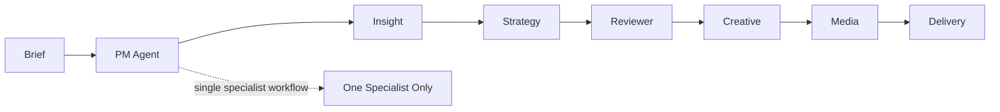

## 每个步骤在做什么

| 节点 | 作用 |
| --- | --- |
| PM | 路由、状态控制、Gate、汇总交付 |
| Insight | 补行业、竞品、趋势与公开研究信息 |
| Strategy | 收敛 brief 挑战，形成传播命题与策略骨架 |
| Reviewer | 在下游前做策略质量 Gate |
| Creative | 输出 slogan / 文案 / 脚本 / 创意表达 |
| Media | 输出内容种草、平台打法、达人与投放建议 |

## 产品化设计

- **标准工作流**：用于完整广告项目，从 Brief 一路走到最终交付
- **单节点工作流**：用于只调某一个 Specialist 的场景，例如 `strategy-only` 或 `media-only`
- **Gate 机制**：用户可以在关键节点决定继续、修改、补充信息或终止
- **Reviewer 机制**：Strategy 先经过质量审核，再进入 Creative / Media
- **人机协同评估**：机器先审、人工再审，后续可用来做 reviewer calibration
- **多入口接入**：支持 Dashboard 和企业微信两种使用方式

---

## 1. OpenClaw 完整链路展示

下面这组图展示的是在 OpenClaw Dashboard 中跑完整标准链路的过程。

### 1.1 Brief 进入 PM，自动起完整链路

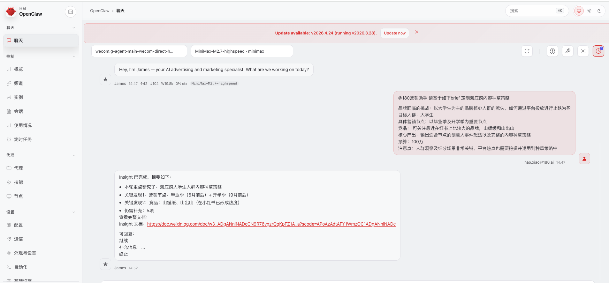

### 1.2 Insight 先补研究，再进入确认口

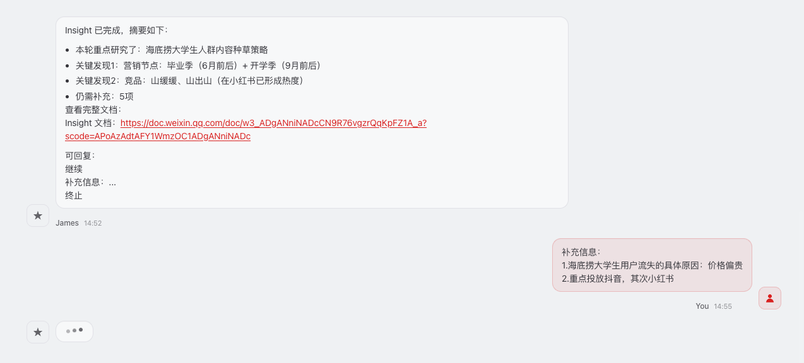

### 1.3 Strategy 经 Reviewer 质检后停在确认口

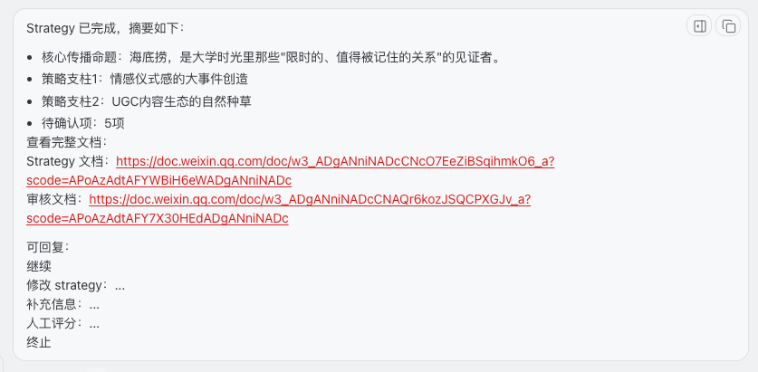

### 1.4 Creative / Media 继续向下游交付

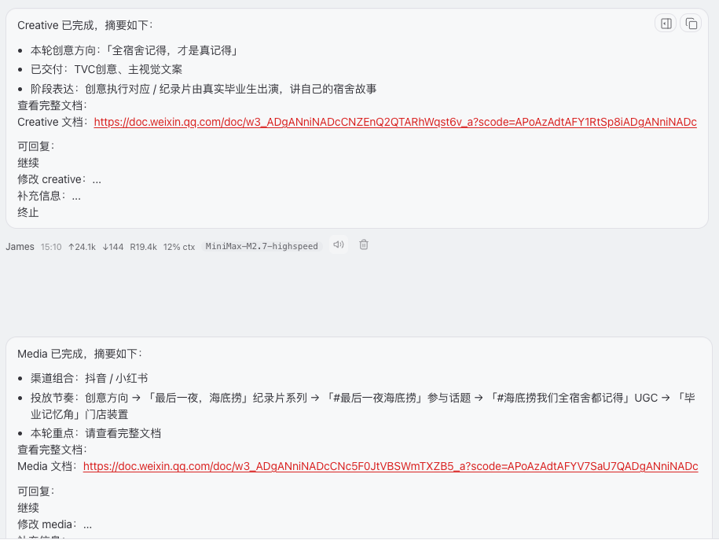

### 1.5 最终汇总交付

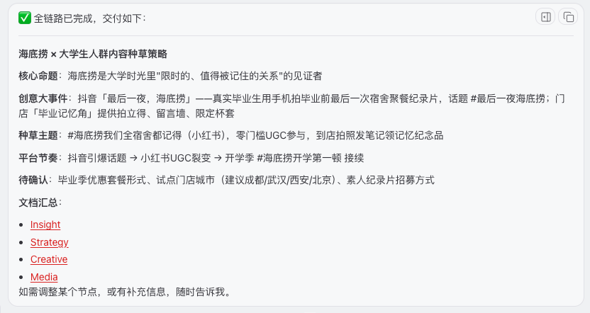

查看更多 OpenClaw 测试截图（download-0 ~ download-9）

  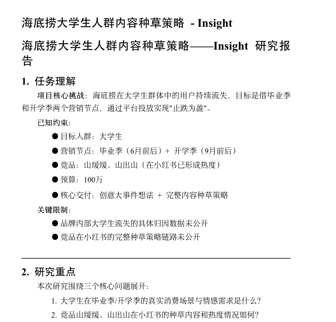
  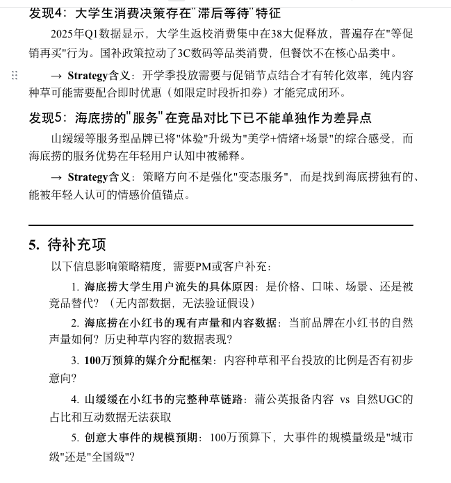

  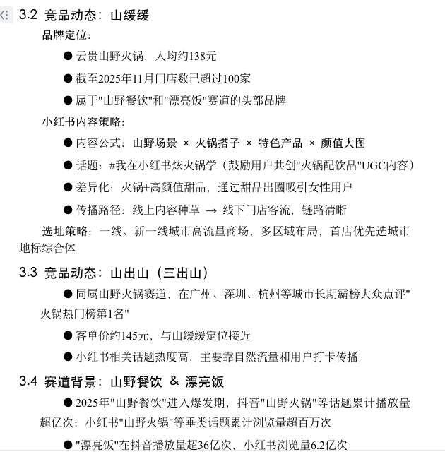
  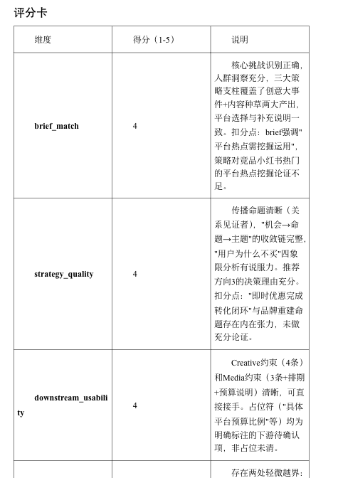

  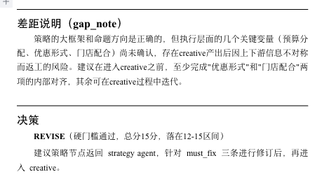

---

## 2. 企业微信完整链路展示

同一条标准链路也可以直接跑在企业微信里，对外输出会收成“摘要 + 文档链接”的形式。

### 2.1 企业微信里输入 Brief

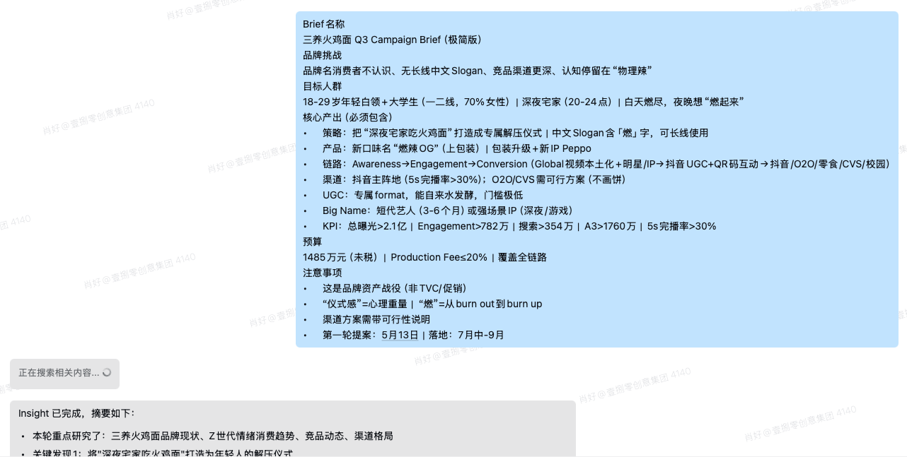

### 2.2 Insight 返回摘要和文档链接

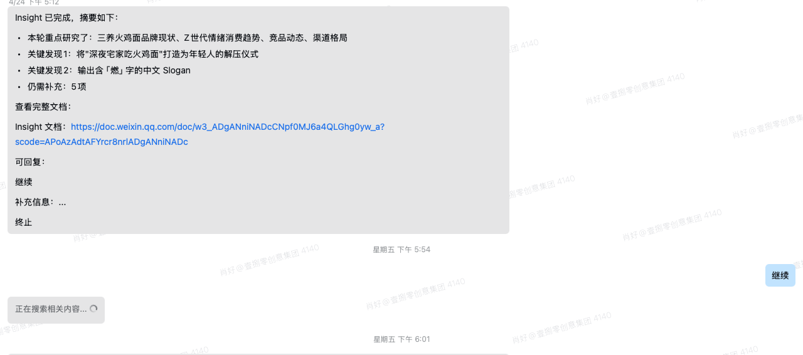

### 2.3 Strategy 返回摘要，并附上 Strategy / Reviewer 文档

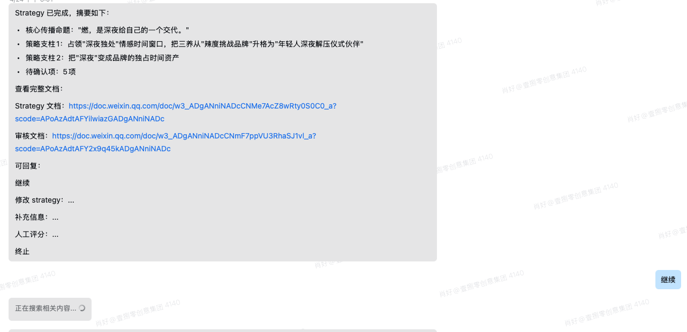

### 2.4 Creative 返回摘要和文档链接

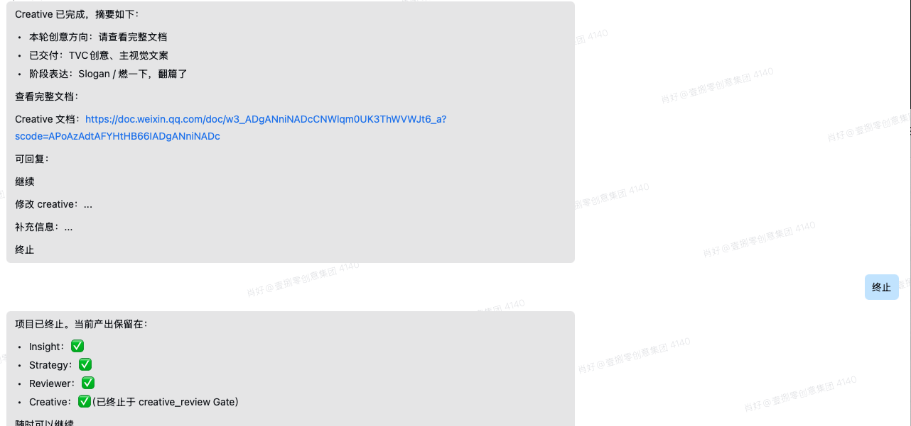

### 2.5 最终 Creative 文档

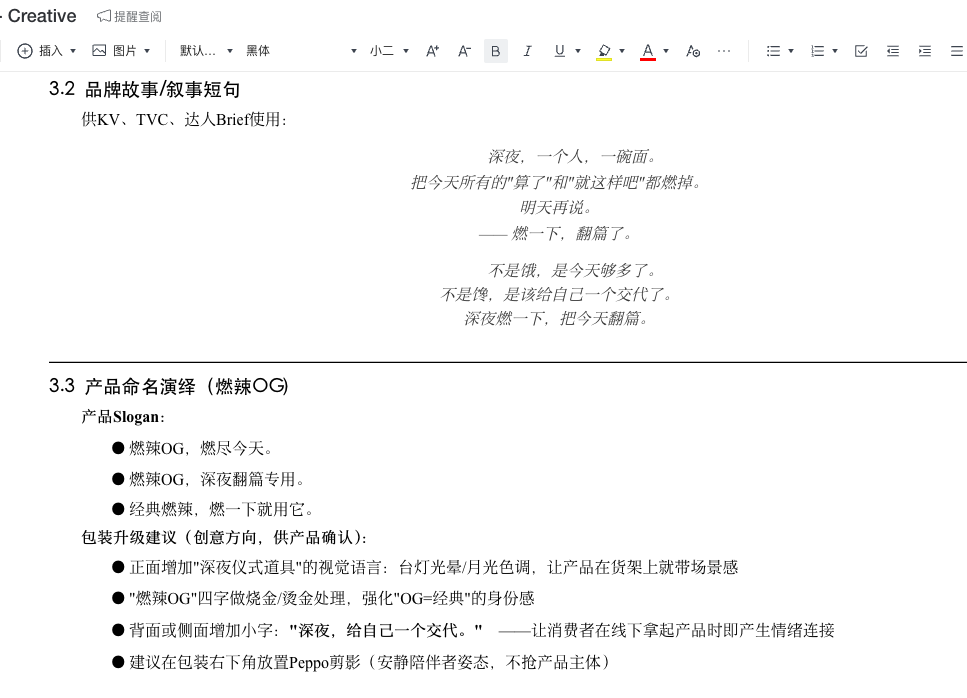

### 2.6 基于 Creative 文档生成广告 KV

这一步不是再写策略，而是把企业微信链路里产出的 Creative 文档，直接交给 Claude Code / Opus 继续生成视觉物料。

  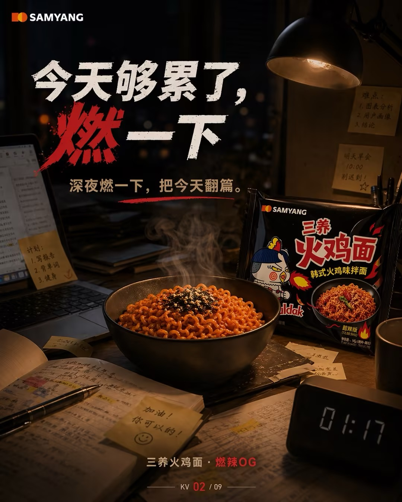
  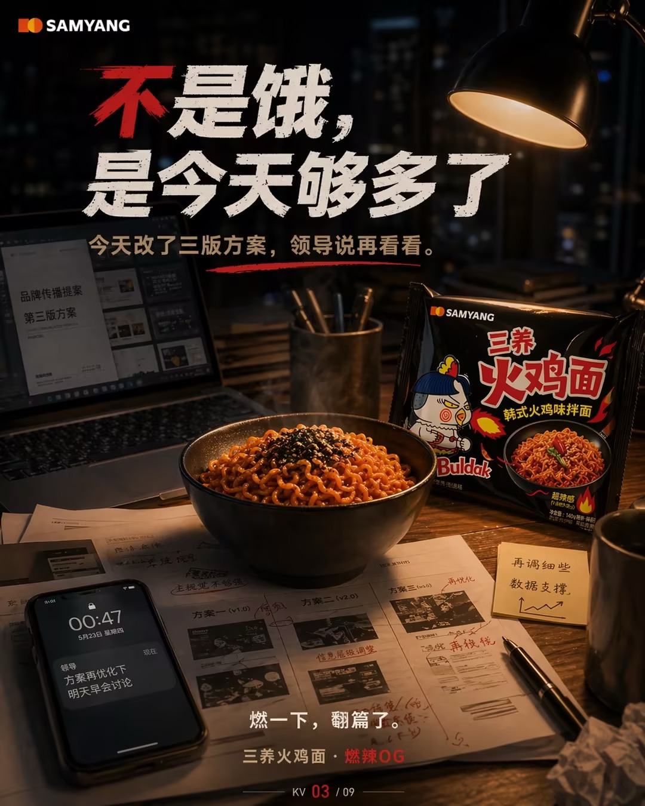
  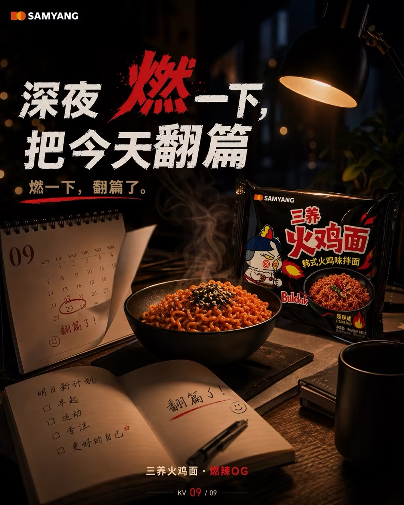

### 2.7 最终广告视频

Creative 文档 -> 广告 KV -> 最终视频，这一步也已经跑通。  
点击下面的封面图可以直接查看仓库里的视频文件：

直接链接：[`ad-video.mp4`](assets/readme/output/ad-video.mp4)

---

## 3. 单一链路展示

这条链路已经支持：

- `insight-only`
- `strategy-only`
- `creative-only`
- `media-only`

这一部分的截图我后续再补到仓库里。
